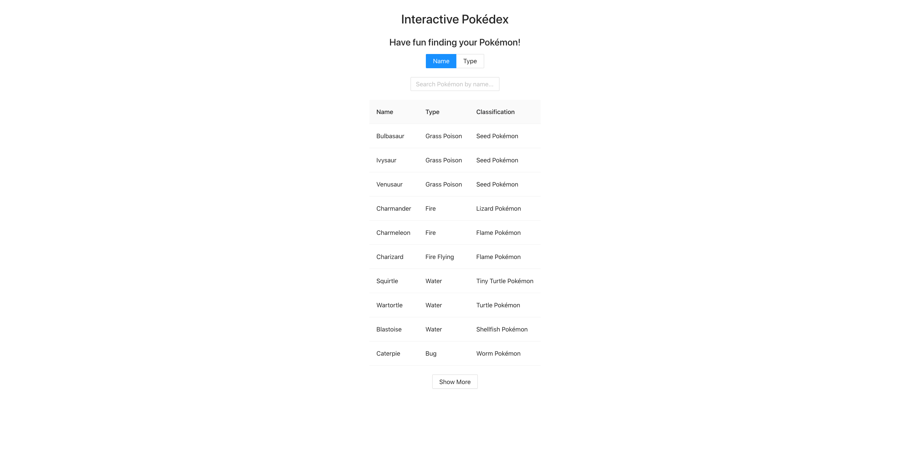

# Satispay Frontend Recruitment Assignment

## Introduction

The project is a single page (and a server app) for querying and filtering a dataset of Pokémons hardcoded in the project.

The target of audience are other Satispay colleagues that can interact with internal dashboard/consoles.
The browser compatibility is assumed for the latest version of `Google Chrome`.

## Installation

#### 1. Clone Repository

#### 2. Install dependencies

`yarn install`

#### 3. Run local server in terminal

`yarn server`

#### 4. Run client in another terminal

`yarn client`

## Technologies Used

The server app is powered by Node.js, `typescript` and [`apollo-server`](https://www.apollographql.com/docs/apollo-server/).
The client app is be powered by `typescript`, `react`, [`apollo-client`](https://www.apollographql.com/docs/react/) and [`antd`](https://ant.design/).

The server schema follows the [relay](https://facebook.github.io/relay/graphql/connections.htm) standard for connection.

This project is powered by `yarn` and workspaces.

## Meeting the Requirements

### Server side

Implement `pokemonsByType` query: it accepts a `type: String` parameter and return a connection of Pokèmons.

- Used [`filter`](https://developer.mozilla.org/en-US/docs/Web/JavaScript/Reference/Global_Objects/Array/filter) and [`indexOf`](https://developer.mozilla.org/en-US/docs/Web/JavaScript/Reference/Global_Objects/Array/indexOf) to look for Pokémon based on a selected `type`

### Components

- **FilterWrapper:** Wrapper to conditionally render `FilterByName` or `FilterByType` component
- **FilterByName:** Search Pokémon by name
- **FilterByType:** Filter Pokémon by type
- **PokeTable:** Table displaying pokemon data based on search by name **OR** filter by type

### Client side

In the bullet points, I describe how I met the challenges.

- User can search Pokémons by name

  - In the `FilterByName` component, I use the [`useQuery`](https://www.apollographql.com/docs/react/data/queries/) hook by passing the user's input in the search bar to execute the `pokemons` query. The search bar follows incremental search based on the Pokémon name so that the user gets feedback for each letter that he/she enters in search bar.

- User can filter Pokémons by type
  - In the `FilterByName` component, I use the [`useQuery`](https://www.apollographql.com/docs/react/data/queries/) hook by passing the user's selected type from the dropdown menu to execute the `pokemonsByType` query.

* User can see results of Pokémons in a table with columns: `name`, `type`, `classification`

  - In `FilterByName` and `FilterByType` components, I pass an array of `Pokemon` objects via `props` to the `PokeTable` based on user's search by name **or** filter by type

* User can load more Pokemon table rows if `hasNextPage` is true

  - I use the [`fetchMore`](https://www.apollographql.com/docs/react/pagination/core-api/#the-fetchmore-function) and [`updateQuery`](https://www.apollographql.com/docs/react/caching/advanced-topics/) functions from `Apollo Client` to combine the previous result of Pokemon to the subsequent ones based on the `endCursor` variable in either the `pokemons` or `pokemonsByType` query

## Challenges and Improvements

My challenge towards the end was to conditionally render the search bar or dropdown filter based on the user's filtering preference: `byName` or `byType`. I first approached this challenge by using a variable to store the `gql` query to be passed in the `useQuery` hook based on the state of either `byName` or `byType`. This approach would break my code to display more Pokemon when the user clicked on the `Show More` button. Therefore, I decided to have two separate components: `FilterByName` and `FilterByType`.

I am aware that these components are similar so refactoring them would be best for cleaner code.

#### Thank you for your time in reviewing my submission and looking forward to your feedback.
